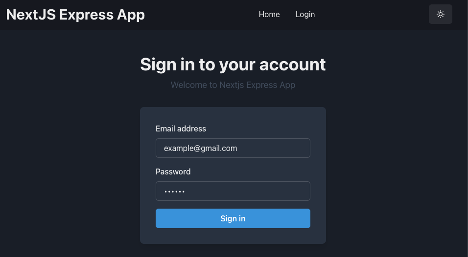

# Nextjs Express

<!--toc:start-->

- [Nextjs Express](#nextjs-express)
  - [Tools and Tech](#tools-and-tech)
    - [Infrastructure](#infrastructure)
    - [Front-End](#front-end)
    - [Authentication](#authentication)
    - [Back-End](#back-end)
  - [Project Features](#project-features)
  - [Getting Started](#getting-started)
    - [Run Postgresql on docker](#run-postgresql-on-docker)
  - [How to test](#how-to-test)
  - [Screenshot](#screenshot)
  - [Credit](#credit)
  <!--toc:end-->

A robust and scalable full-stack application built with modern web technologies and best practices.

## Tools and Tech

### Infrastructure

- **Turborepo**: Efficiently manage our monorepo structure.
- **Docker**: Containerized environments for consistent development and deployment.
- **Husky**: Automate and enforce code quality checks with Git hooks.
- **Commitlint**: Ensure commit messages follow a specific convention.
- **Lint-staged**: Run linters on staged files before committing.
- **Release-it**: Automate versioning and releases.

### Front-End

- **Next.js 14**: The latest version of Next.js for server-side rendering and static site generation.
- **Chakra UI**: A simple, modular, and accessible component library for React.
- **React Hook Form**: Performant, flexible, and extensible forms with easy-to-use validation.
- **Yup**: Schema builder for value parsing and validation.

### Authentication

- **Login, Logout, GetMe, Refresh Token**: Secure authentication flows with HttpOnly cookies and middleware.
- **Redux Toolkit**: Simplified state management with Redux.

### Back-End

- **Express**: Minimalist web framework for Node.js.
- **Logger**: Centralized and customizable logging.
- **Response Handler & Error Handler**: Standardized response and error handling mechanisms.
- **PostgreSQL**: Powerful, open-source object-relational database system.
- **Prisma ORM**: Next-generation ORM for Node.js and TypeScript.
- **Joi**: Powerful schema description and data validation.
- **Vitest**: Blazing fast unit testing framework.

## Project Features

- **UI/UX**: Built with Chakra UI for a modern and responsive design.
- **Forms**: Handle complex form interactions and validations with React Hook Form and Yup.
- **Authentication**: Secure authentication system with JWT, refresh tokens, and HttpOnly cookies.
- **API**: Robust back-end API with Express, including logging, response handling, and error handling.
- **Database**: Utilize PostgreSQL and Prisma ORM for efficient data management.
- **Validation**: Ensure data integrity with Joi schemas.
- **Testing**: Write and run unit tests with Vitest to ensure code quality and reliability.

## Getting Started

### Run Postgresql on docker

```bash
make dev-postgres-local
```

## How to test

```bash
yarn workspace api test:int
yarn workspace api test:int -t [filter]
yarn workspace api test:int:watch
yarn workspace api test:cov
```

## Screenshot



## Credit

[chakra-templates](https://chakra-templates.vercel.app/)
